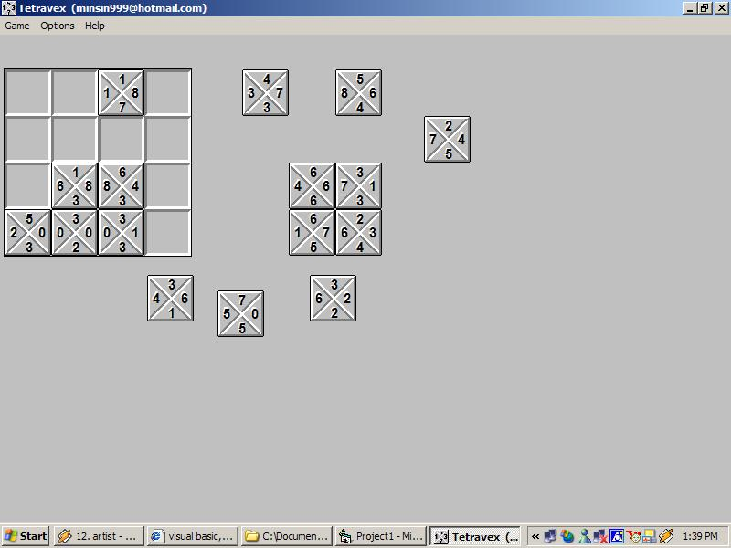

<div align="center">

## Digit Blocks Game


</div>

### Description

A little game simulation of Microsoft(R) Tetravex

Game.

You have to arrange all the blocks in the block-holders so that the adjacent digits are the same.

If they are not the same, the block being placed will go back to its original place.

Try it!!
 
### More Info
 


<span>             |<span>
---                |---
**Submitted On**   |2002-11-30 13:40:06
**By**             |[Min Thant Sin](https://github.com/Planet-Source-Code/PSCIndex/blob/master/ByAuthor/min-thant-sin.md)
**Level**          |Intermediate
**User Rating**    |5.0 (20 globes from 4 users)
**Compatibility**  |VB 6\.0
**Category**       |[Games](https://github.com/Planet-Source-Code/PSCIndex/blob/master/ByCategory/games__1-38.md)
**World**          |[Visual Basic](https://github.com/Planet-Source-Code/PSCIndex/blob/master/ByWorld/visual-basic.md)
**Archive File**   |[Digit\_Bloc15054811302002\.zip](https://github.com/Planet-Source-Code/min-thant-sin-digit-blocks-game__1-41160/archive/master.zip)

### API Declarations

```
Type RECT
   Left As Long
   Top As Long
   Right As Long
   Bottom As Long
End Type
Public Declare Function IntersectRect Lib "user32" (lpDestRect As RECT, lpSrc1Rect As RECT, lpSrc2Rect As RECT) As Long
```


